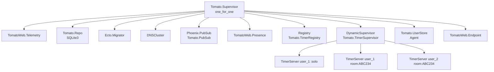
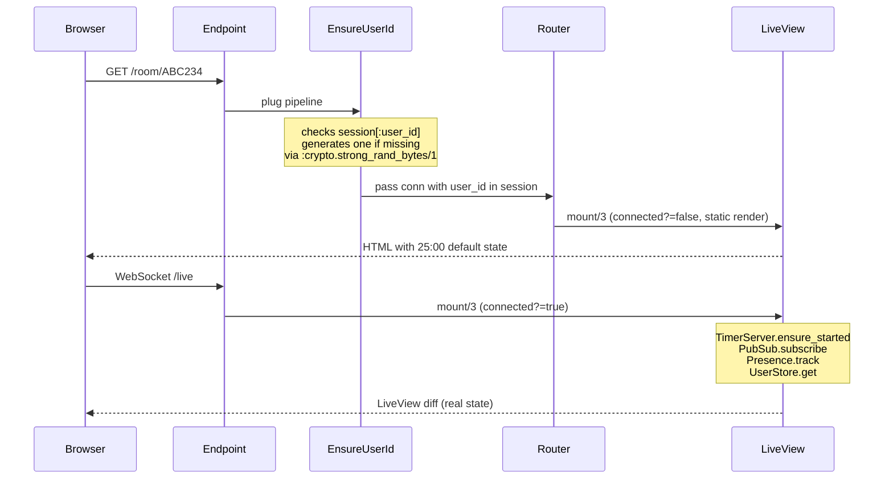
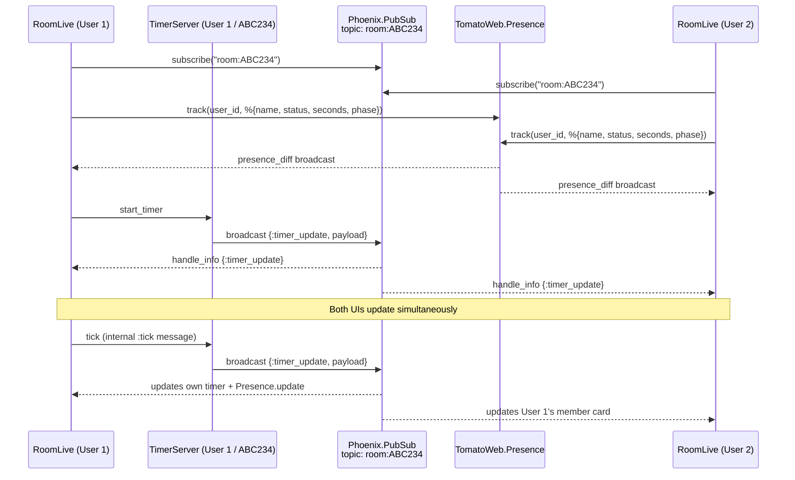
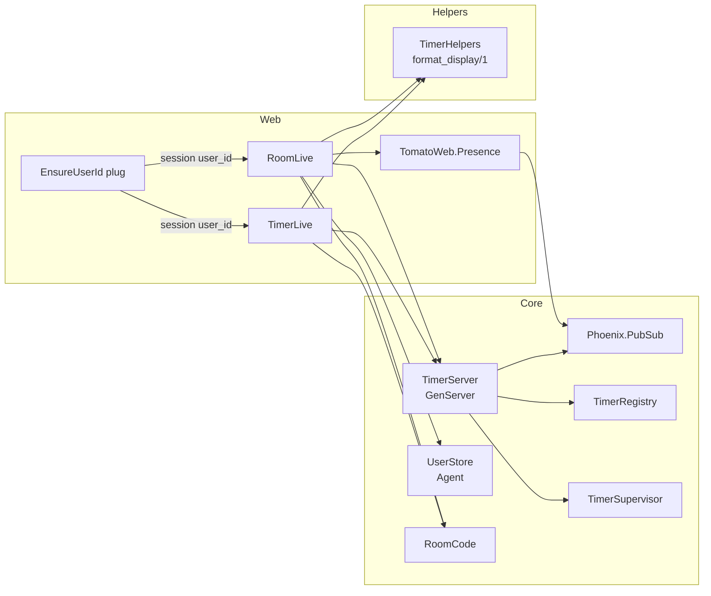
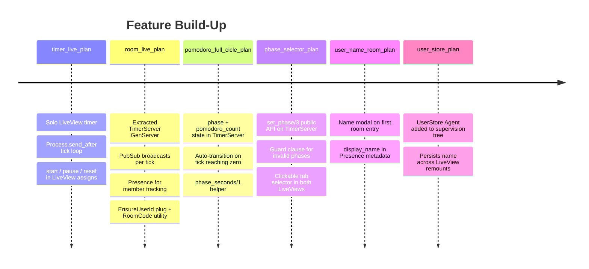
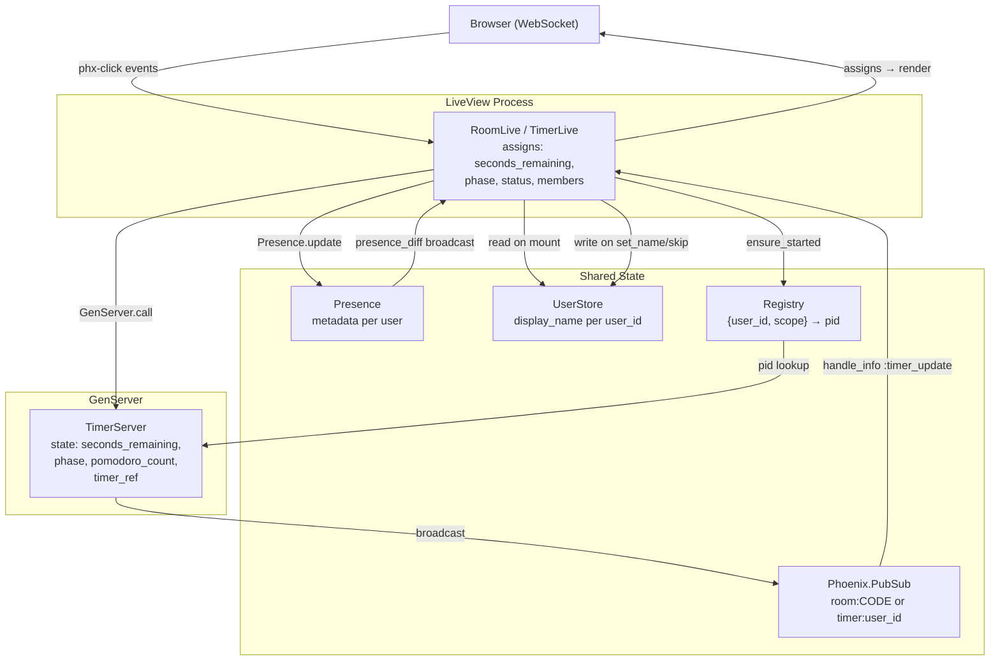

# Tomato Focus — Architecture

## 1. OTP Supervision Tree

The app starts ten supervised processes in a `one_for_one` strategy. If any child crashes it is restarted independently.



**Key design choices:**
- `TimerRegistry` is a `{user_id, scope}` → `pid` lookup table. `scope` is either `:solo` or a room code string like `"ABC234"`.
- `TimerSupervisor` spawns one `TimerServer` per `{user_id, scope}` pair on demand, via `ensure_started/2` (idempotent).
- `UserStore` is a plain `Agent` holding a map of `user_id → %{display_name, has_custom_name}`. It persists for the lifetime of the app process, surviving LiveView remounts.

---

## 2. HTTP Request & LiveView Connection Lifecycle



Every browser session gets a stable `user_id` from a signed cookie. The LiveView mounts **twice** — once for the static HTTP render (no subscriptions) and once for the live WebSocket connection (full setup).

---

## 3. Timer State Machine

The `TimerServer` GenServer is the single source of truth for timer state. All LiveViews are just subscribers.

```mermaid
stateDiagram-v2
    [*] --> stopped_focus : init (25:00)

    stopped_focus --> running_focus : start
    running_focus --> paused_focus : pause
    paused_focus --> running_focus : start (resume)
    running_focus --> stopped_focus : reset

    running_focus --> running_short_break : tick reaches 0\npomodoro_count++ (1-3)
    running_focus --> running_long_break : tick reaches 0\npomodoro_count++ (4th, rem==0)

    running_short_break --> stopped_focus : tick reaches 0
    running_long_break --> stopped_focus : tick reaches 0

    note right of running_focus
        :tick every 1 000 ms
        via Process.send_after
    end note

    note right of running_short_break
        Auto-starts (5:00)
        User must manually
        start next focus
    end note
```

**Tick scheduling** — idiomatic Erlang self-scheduling loop. No `setInterval`. Each tick schedules exactly one next tick, making pause trivial (just don't schedule the next one):

```
start → [1s] → :tick → [1s] → :tick → ... → 0 → transition
```

---

## 4. PubSub & Presence — Multi-User Room Synchronisation



Each user has their **own independent** `TimerServer`. There is no shared global clock. What's synchronised is the *visibility* — every tick a user's server broadcasts its state to the room topic, and all subscribers (other users' LiveViews) update their copy of that member's card.

---

## 5. Module Dependency Map



---

## 6. Feature Evolution (from `/plan`)

The app was built incrementally. Each plan introduced a new architectural layer:



> The **most significant architectural shift** was between `timer_live_plan` and `room_live_plan`: the tick loop moved out of the LiveView process and into a supervised `GenServer`. This decoupled the timer lifecycle from the browser connection — the timer keeps running even if the WebSocket briefly disconnects.

---

## 7. Data Flow Summary



The **browser never talks to the timer directly** — it sends click events to the LiveView, which delegates to the GenServer via `GenServer.call`. The GenServer is the authority and pushes updates back to all subscribers via PubSub. The LiveView is purely a view layer that reacts to those updates.
