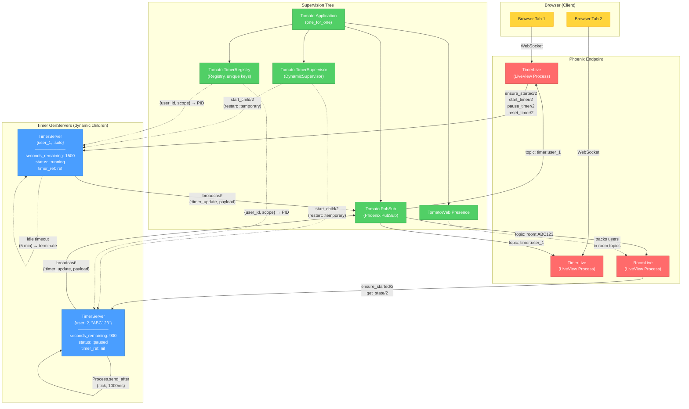

# Persist Timer State via GenServer (Survives LiveView Disconnects)

## Context

On iOS Safari, switching away suspends the tab, killing the WebSocket. The LiveView process eventually dies, and `mount/3` runs fresh — resetting the timer to 25:00. This happens because timer state lives only in LiveView process memory.

**Solution:** Move the timer tick loop into a separate `Tomato.TimerServer` GenServer that runs independently under a DynamicSupervisor. LiveViews become thin clients that send commands and receive updates via PubSub. When a LiveView dies and remounts, it reconnects to the still-running GenServer.

## Architecture

```
DynamicSupervisor (Tomato.TimerSupervisor)
  └─ TimerServer {user_id, :solo}      ← for TimerLive at /
  └─ TimerServer {user_id, "ABC234"}   ← for RoomLive at /room/ABC234

Registry (Tomato.TimerRegistry)
  └─ lookup by {user_id, scope}

Flow:
  LiveView mount → ensure_started → subscribe PubSub → get_state
  User clicks Start → LiveView calls TimerServer.start_timer
  GenServer ticks → broadcasts {:timer_update, payload} via PubSub
  LiveView handle_info → updates assigns from broadcast
  Tab suspends → LiveView dies → GenServer keeps ticking
  Tab resumes → fresh mount → reconnects to existing GenServer → current state restored
```

## Implementation Steps

### Step 1: Create `lib/tomato/timer_server.ex`

New GenServer module. Key design:

- **Key:** `{user_id, scope}` where scope is `:solo` or a room code string
- **Registry via-tuple:** `{:via, Registry, {Tomato.TimerRegistry, {user_id, scope}}}`
- **`restart: :temporary`** — crashed timers are not auto-restarted; next mount creates a fresh one
- **State:** `%{user_id, scope, seconds_remaining, status, timer_ref}`
- **Idle auto-termination:** 5-minute OTP timeout when not running (paused/stopped)

**Public API:**
```elixir
ensure_started(user_id, scope)       # idempotent — starts or finds existing
get_state(user_id, scope)            # {:ok, state_map} | {:error, :not_found}
start_timer(user_id, scope)          # GenServer.call → :ok
pause_timer(user_id, scope)          # GenServer.call → :ok
reset_timer(user_id, scope)          # GenServer.call → :ok
topic(user_id, scope)                # "timer:#{user_id}" for :solo, "room:#{code}" for rooms
```

**Broadcast:** On every state change (start/pause/reset/tick/complete), broadcasts `{:timer_update, %{user_id, status, seconds_remaining}}` on the appropriate PubSub topic. Uses `call` (not `cast`) so LiveView knows the command was processed.

**Tick loop:** `Process.send_after(self(), :tick, 1000)` — same mechanism, just runs in the GenServer instead of the LiveView.

### Step 2: Update `lib/tomato/application.ex`

Add Registry and DynamicSupervisor before Endpoint:

```elixir
{Phoenix.PubSub, name: Tomato.PubSub},
TomatoWeb.Presence,
{Registry, keys: :unique, name: Tomato.TimerRegistry},
{DynamicSupervisor, name: Tomato.TimerSupervisor, strategy: :one_for_one},
TomatoWeb.Endpoint
```

### Step 3: Update `lib/tomato_web/live/timer_live.ex`

Convert to thin GenServer client:

- **mount:** Read `session["user_id"]`. When `connected?`, call `ensure_started` + subscribe to `"timer:#{user_id}"` + `get_state` to recover state. Remove `timer_ref` assign.
- **Event handlers:** One-liners that call `TimerServer.start_timer/pause_timer/reset_timer` and return `{:noreply, socket}` unchanged.
- **`handle_info({:timer_update, payload})`:** Updates `seconds_remaining` and `status` from broadcast.
- **Remove:** `handle_info(:tick, ...)`, all `Process.send_after`/`Process.cancel_timer` calls, `timer_ref` assign.
- **Template:** No changes needed (`timer_ref` is never referenced in HEEx).

### Step 4: Update `lib/tomato_web/live/room_live.ex`

Same thin-client conversion, plus:

- **mount:** Call `ensure_started(user_id, code)`. After `get_state`, update Presence with recovered status so other members see the correct state immediately.
- **`handle_info({:timer_update, ...})`:** Process ALL messages including own user_id (remove the current `if uid == socket.assigns.user_id, do: {:noreply, socket}` guard). Update `members` map for any user. When it's own user_id, also update top-level assigns + Presence.
- **Remove:** `broadcast_timer_state/1` helper, `handle_info(:tick, ...)`, `timer_ref` assign.

### Step 5: Update tests

**`test/tomato/timer_server_test.exs`** (new) — Unit tests:
- start/pause/reset/tick cycle
- `ensure_started` idempotency
- PubSub broadcast delivery
- Auto-termination after idle

**`test/tomato_web/live/timer_live_test.exs`** — Fix tick tests:
- Replace `send(view.pid, :tick)` with sending `:tick` to the GenServer pid (looked up via Registry), then `:sys.get_state` to synchronize before asserting.

**`test/tomato_web/live/room_live_test.exs`** — Same tick test fixes.

**`test/tomato_web/presence_test.exs`** — Same tick test fixes.

## Files Summary

| Action | File |
|--------|------|
| CREATE | `lib/tomato/timer_server.ex` — GenServer with timer logic |
| EDIT   | `lib/tomato/application.ex` — add Registry + DynamicSupervisor |
| EDIT   | `lib/tomato_web/live/timer_live.ex` — thin client |
| EDIT   | `lib/tomato_web/live/room_live.ex` — thin client + Presence |
| CREATE | `test/tomato/timer_server_test.exs` — GenServer unit tests |
| EDIT   | `test/tomato_web/live/timer_live_test.exs` — fix tick tests |
| EDIT   | `test/tomato_web/live/room_live_test.exs` — fix tick tests |
| EDIT   | `test/tomato_web/presence_test.exs` — fix tick tests |

## Architecture Diagram



### How it works

1. **On mount** — LiveView calls `TimerServer.ensure_started(user_id, scope)` which either finds an existing GenServer via the Registry or starts a new one under the DynamicSupervisor
2. **User actions** (start/pause/reset) — LiveView calls the TimerServer API; the GenServer updates its state and broadcasts via PubSub
3. **Tick loop** — The GenServer sends itself a `:tick` message every 1 second using `Process.send_after/3`, decrementing `seconds_remaining`
4. **PubSub fan-out** — Every tick broadcasts `{:timer_update, payload}` to the topic (`timer:user_id` or `room:code`), so all connected LiveViews update in real-time
5. **Reconnect** — When the browser reconnects, the new LiveView finds the *same* GenServer still ticking and subscribes to updates — no state lost
6. **Idle cleanup** — If the timer is stopped/paused for 5 minutes, the GenServer terminates itself (restart: `:temporary` means it won't restart)

## Edge Cases

- **GenServer crash:** `restart: :temporary` means no auto-restart. Next LiveView command catches the `:exit` and calls `ensure_started` to create a fresh timer.
- **Multiple tabs:** Both share the same GenServer via Registry. Both receive PubSub broadcasts. Fully consistent.
- **Timer completes:** GenServer sets `status: :stopped`, starts 5-min idle timeout, then auto-terminates. Clicking Start after termination creates a fresh 25:00 timer.
- **Presence updates:** Stay in LiveView (requires `self()` as tracked PID). GenServer only handles timer logic + PubSub broadcast.

## Verification

1. `mix compile` — no errors
2. `mix test` — all tests pass
3. Open `/` → start timer → kill the LiveView process (or simulate iOS suspend) → remount → timer continues from correct position
4. Open `/room/CODE` → start timer → disconnect → reconnect → timer restored, other members see correct state
5. Open same page in two tabs → both show identical state, clicking in one updates both
